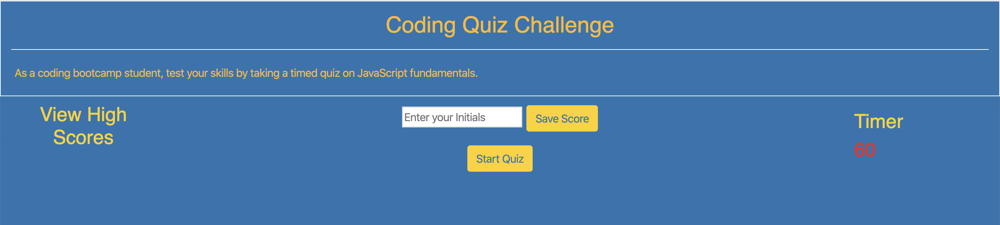

The challenge here was to build a timer-based quiz application that stores high scores in client-side local storage. 

Once on the web page as picture below, type in your initials and press "Start Quiz".  A series of questions will be asked.  Select the approrpiate radio button and click the "Next" button to get the next question.  Once you've completed the test, the score will be displayed and you'll be given the opportunity to take the quiz again.

If the timer runs out, you'll also be given the cahnce to start again.

Score is calculated by time remaining. Answering quickly and correctly results in a higher score. Answering incorrectly results in a time penalty (for example, 15 seconds are subtracted from time remaining).

